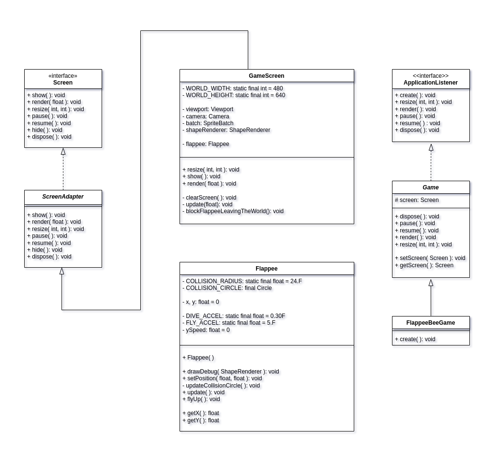

# Flappee_Java_GDX

Simple Flappy-Game-Clone implemented in Java/GDX.

## Game-Preview

## UML-Diagram

## History
<table>
<thead>
<th>Date</th>
<th>Description</th>
</thead>
<tr>
  <td>2023-04-07</td>
  <td>Empty Game-Set created.</td>
</tr>
<tr>
  <td>2023-04-08</td>
  <td>Shape-Render of Flappy created and implemented. UML-Diagram created.</td>
</tr>
</table>
